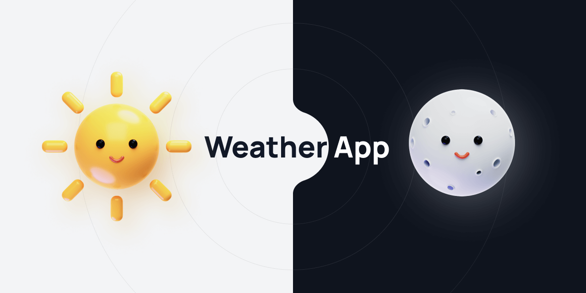
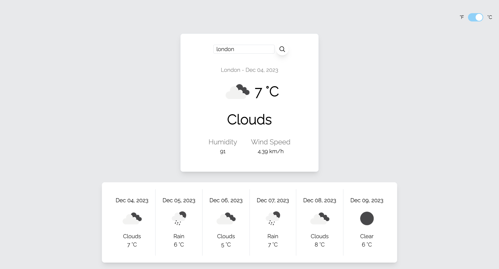

<div align="center">
  
</div>
<br>

<p align="center">
	<strong>Forecasting Simplicity: Your Weather, Your Way with React! </strong>
</p>


<br>

<br>

## How it works

#### 1. Fork and clone

```bash
# Clone the repository
$ git clone [link of the repo]
# Move into the repository
$ cd [repo-name]
```

#### 2. Project setup

Open the clone repo in your preferred code editor.After that, you can install the dependencies either using NPM or Yarn:

```sh
npm install

#OR if Yarn then

yarn install

```

#### 4. Start the project

Run the app locally by running the following command:

```sh
npm run dev

#OR if Yarn then

yarn run dev

```

The app will run on [localhost:3000](http://localhost:3000/) so go ahead and open it.

## Test Cases

Run the test cases by running the following command:

```sh
npm run test

#OR if Yarn then

yarn run test

```

## Output


